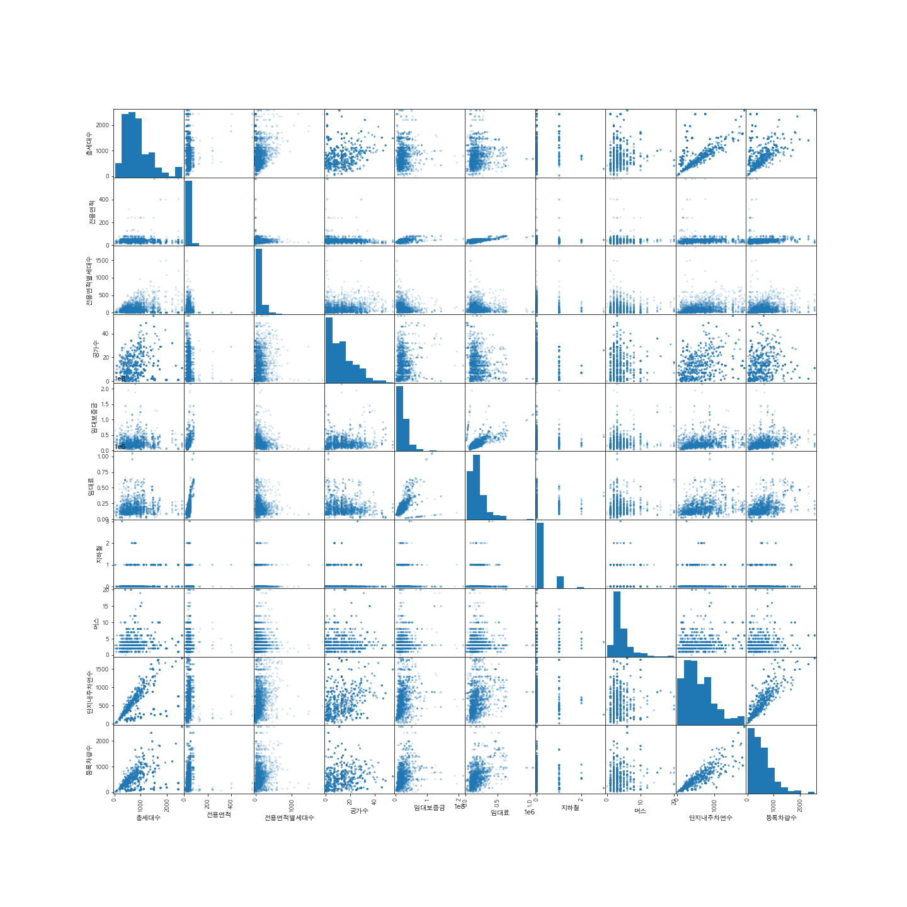
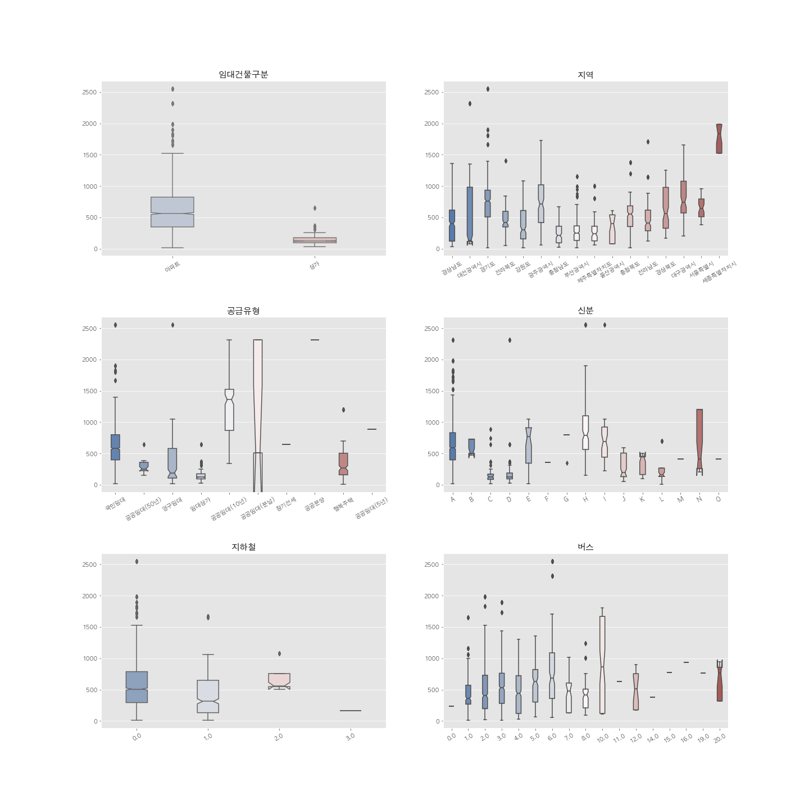
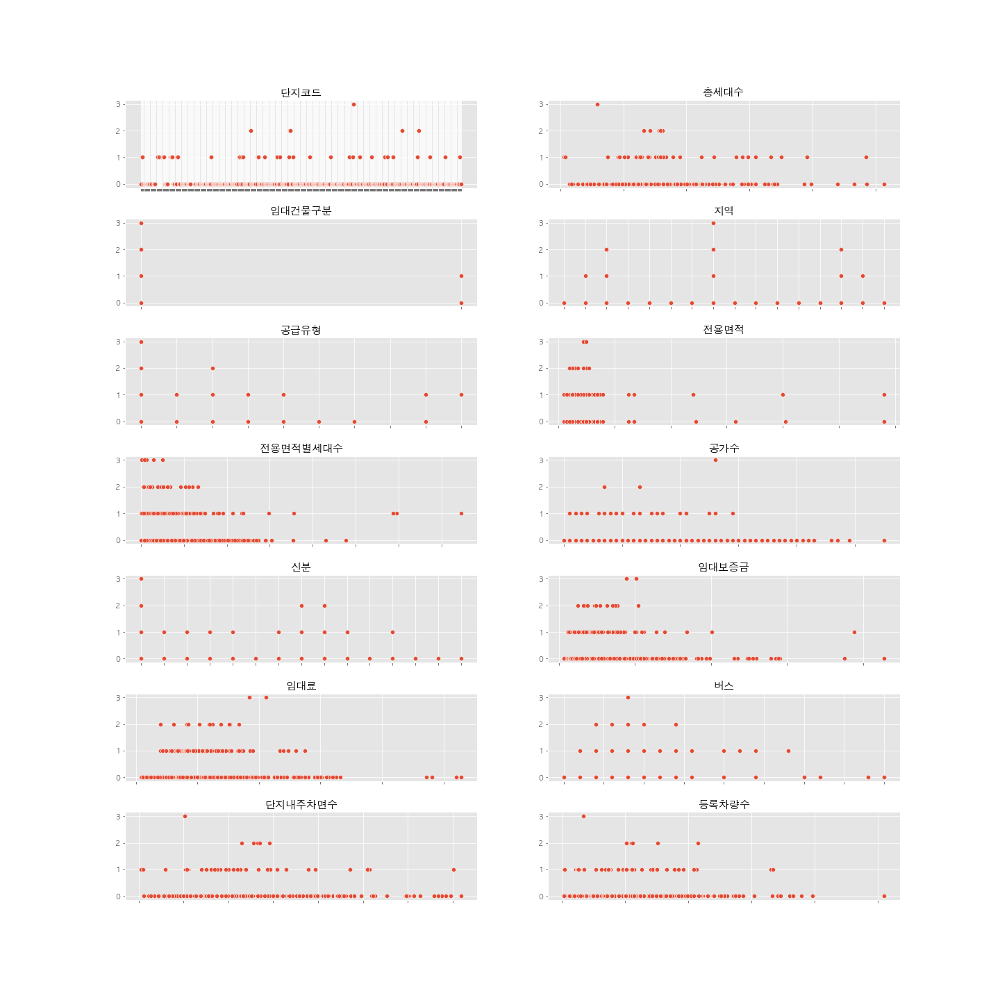
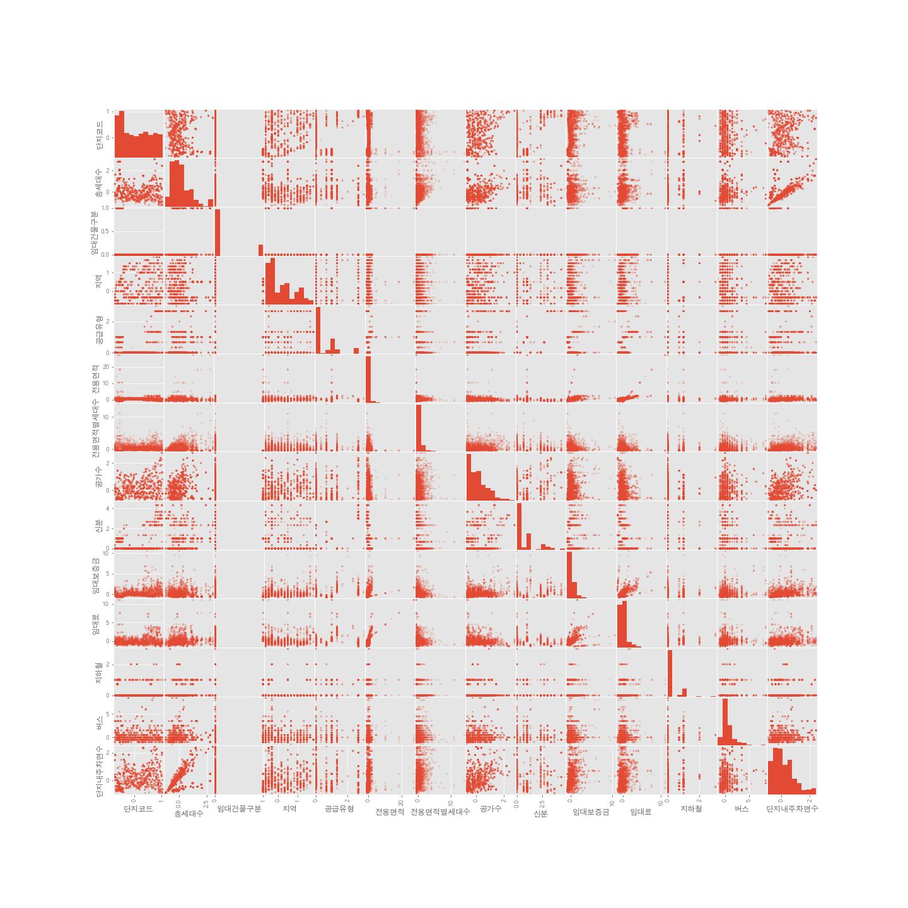
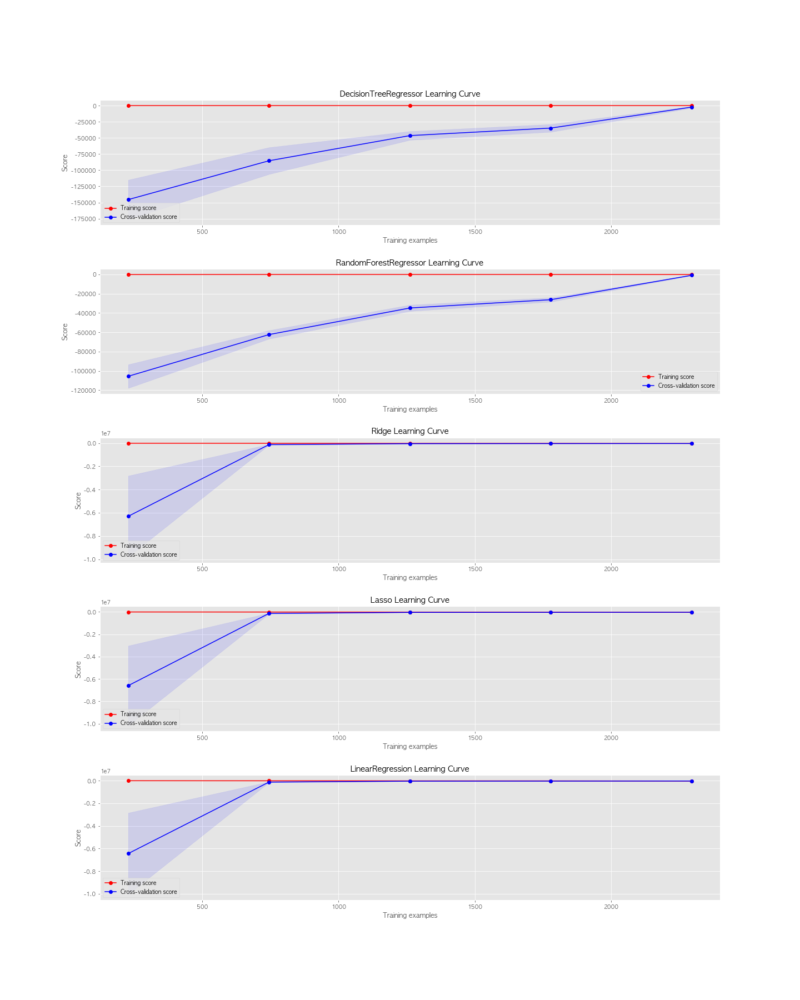
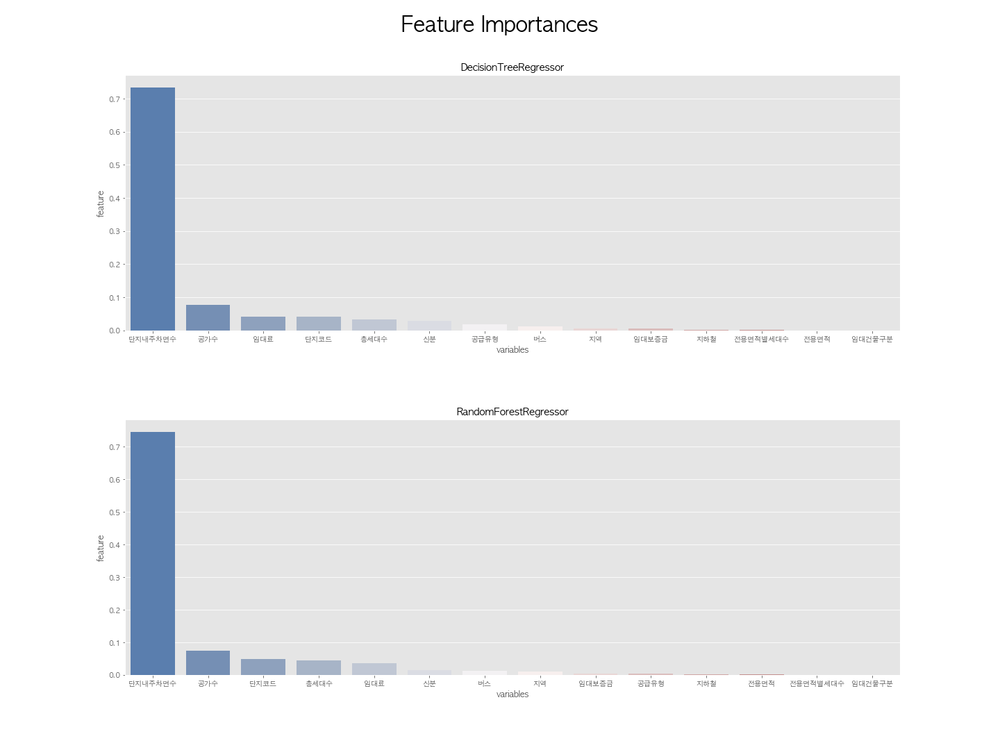
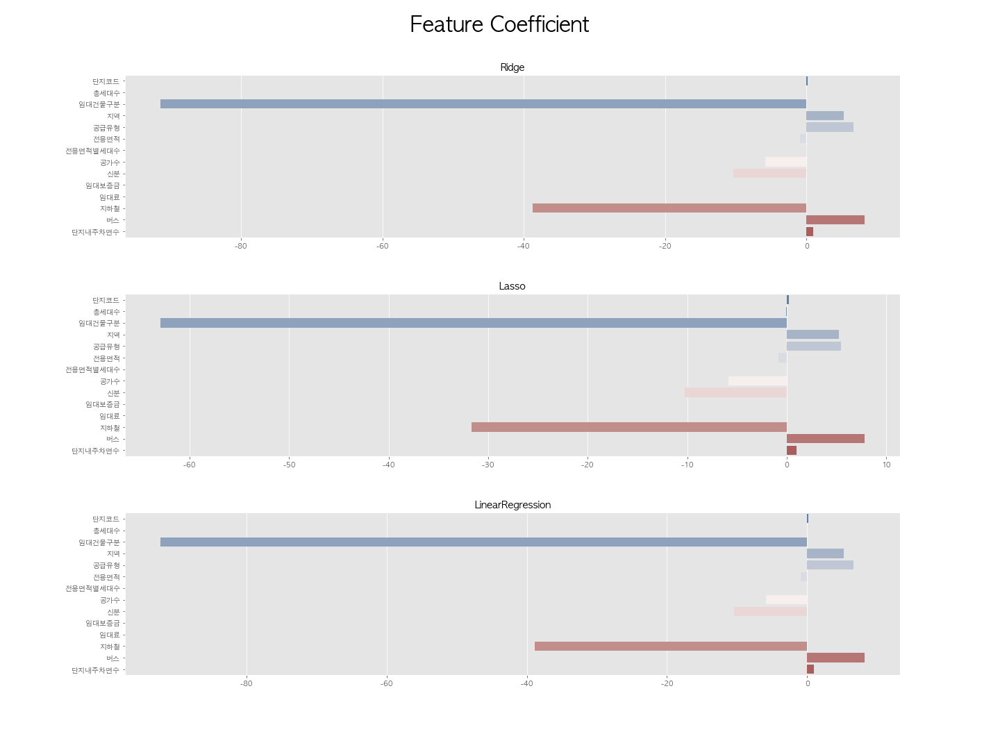

# Spotify Song Hit or Flop Prediction
 

## 목차
- [Introduction](#introduction)
- [Overview of the Data](#overview-of-the-data)
- [Preprocessing](#preprocessing)
- [Machine Learning Modeling](#machine-learning-modeling)
    * [Testing algorithm](#testing-algorithm)
    * [Feature Importances](#feature-importances)
    * [Learning Curve](#learning-curve)
    * [Confusion Matrix](#confusion-matrix)
    * [Conclusion](#conclusion)
- [Retrospect](#retrospect)

# Introduction
단지 내의 적절한 수차 수요를 예측하여 필요한 주차대수를 알아내기 위한 프로젝트.  
데이콘의 주차수요 예측 AI 경진대회의 메인 데이터로 사용하였고 결측치 처리를 하기 위해서 공공데이터포털에서 주택관리공단의 임대상가 데이터를 사용하였다. 

데이콘 : https://dacon.io/competitions/official/235745/overview/description  
공공데이터포털 : https://www.data.go.kr/data/15069062/fileData.do

# Overview of the Data

- 14개의 특성 컬럼과 1개의 타켓 컬럼 총 15개의 컬럼으로 구성 
- 주택의 여러가지 특성들을 나타낼 수 있는 컬럼들로 구성되어 있어 각 컬럼별로 나타내고 있는 개념들이 다르고 의미하는 바가 다르다.

# Preprocessing

- 임대보증금, 임대료, 지하철 컬럼에 결측치가 존재하였다. 

### 지하철 

- 모든 지역에 지하철이 있는 것이 아니고 지역마다 지하철의 역개수가 크게 차이난다.
- 지하철 역 개수는 서울 총 324개, 부산 총 150개, 인천 총 57개, 대전 총 22개, 광주 총 20개, 대구 총 91개이다. 
- 따라서 지역별로 평균을 내서 결측치를 처리하는 것이 가장 합리적이라고 생각했다. 

### 임대보증금과 임대료

- 임대건물구분이 아파트인 것과 임대건물구분이 상가인 것으로 나눌 수 있다.
- 임대건물구분이 상가로 되어 있는 경우 전체 데이터의 임대보증금과 임대료가 결측치였다. 데이터내에서 단서를 찾아서 결측치 처리를 하고 싶었으나, 상가와 아파트의 임대보증금과 임대료 형성 기준이 다르다는 판단 하에 고민끝에 외부 데이터(공공데이터포털)를 이용하였다. 
- 평균값 혹은 중간값으로 처리하기엔 데이터를 보았을때 한가지 기준으로 결정된다는 생각이 들지 않았고 임의로 처리하다가는 데이터를 손상시킬 수 있겠다는 판단 하에 회귀분석 Linear Regression 으로 값을 채워넣기로 결정했다.
- 결정계수 값이 높지 않지만 RMSE 값을 보고 회귀분석을 통해서 결측치를 구해도 괜찮다는 생각을 하였다. 임대보증금과 임대료이기 때문에 단위가 클 수 밖에 없고 실제값과 예측값을 다 빼서 더한 값이라는 것을 감안했을때 괜찮다고 판단하였다. 

    |임대건물구분|컬럼|R2 score|RMSE|
    |--- | --- | --- | --- |
    |아파트|임대보증금|0.469571269027485|14240904.729933232|
    |아파트|임대료|0.6908740814964134|69763.20055042396
    |상가|임대보증금|0.6370973165005848|5990304.499549153
    |상가|임대료|0.6877621402438863|165872.95302231706

### Scaling

- 각 컬럼마다 의미하는 바와 단위가 다르고 이상치 영향도 최소화하기 위해서 Robust Scaler를 사용하여서 스케일링을 했다. 

# Machine Learning Modeling
### Testing algorithm

- 총 5가지 모델 (Desicion tree regressor, Random forest regressor, ridge, lasso, Linear regression) 을 사용하였다.
- Test 와 Train 값을 보았을때 차이도 크지 않아 과적합은 이루어지지 않는 것으로 보인다. 규제모델과 Linear regression  보다는 Decision tree와 Random forest 모델이 가장 성능이 좋은 것으로 나타나며 그 중에서도 앙상블 모델인 Random Forest 가 가장 노멀한 모델로 판단된다. 

    |Name|Test r2|Train r2|Test RMSE|Train RMSE|Test MAE|Train MAE|
    | --- | --- | --- | --- | --- | --- | --- |
    |DecisionTreeRegression| 0.989559 | 1.000000 | -1957.981641	| 0.000000 | -6.157542 | 0.000000 |
    |RandomForestRegression | 0.994687 | 0.999055 | -985.794994 | -175.049400 | -12.908472 | -5.021244 | 
    |Ridge| 0.799209 | 0.802941 | -37042.736967 | -36492.920358 | -136.241044 | -135.130113 |
    |Lasso| 0.798995 | 0.802735 | -37083.011116 | -36531.095999 | -136.623068 | -135.511459 |
    |LinearRegression| 0.799205 | 0.802942 | -37043.467422 | 
    -36492.871721 | -136.235105 | -135.122447 |

### Learning curve

- 과적합없이 잘 수렴되고 있다는 것을 알 수 있다.  

 

### Feature Importances

### Conclusion

TBU

# Retrospect 

TBU

#### References
- *상가임대와 주택임대의 장단점 및 주의사항 - 스카이데일리* https://www.skyedaily.com/news/news_view.html?ID=7083)
- *매장용 임대 빌딩의 임대료 걸정요인 분석  (최진, 진창하 2015)* http://www.reacademy.org/rboard/data/krea2_new/62_4.pdf